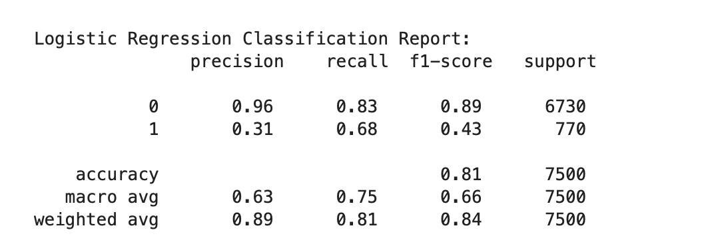
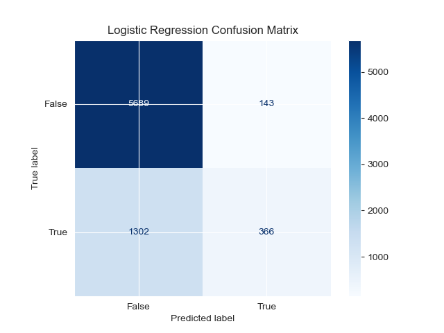
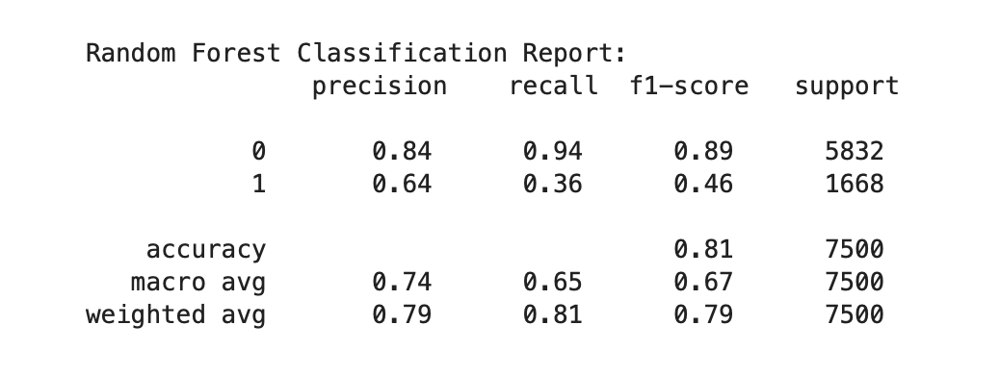
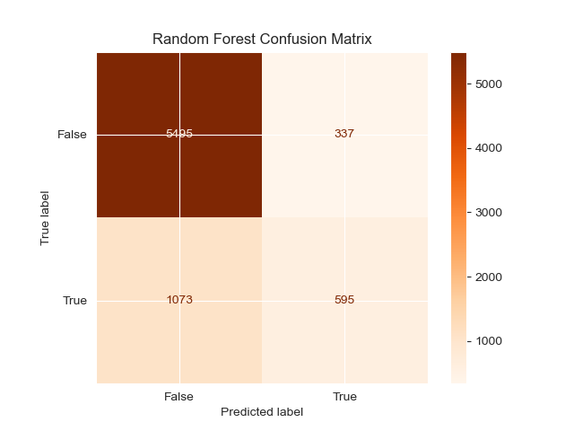
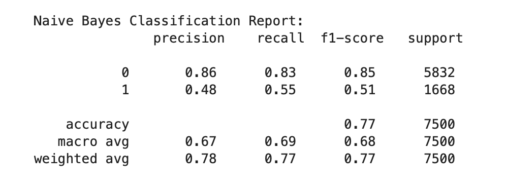
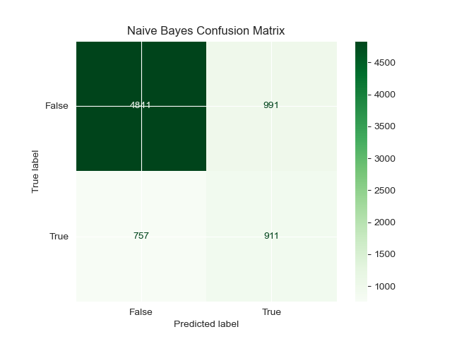
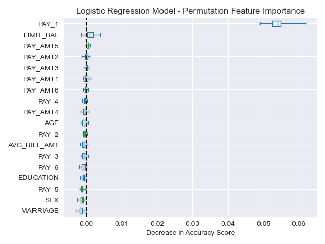
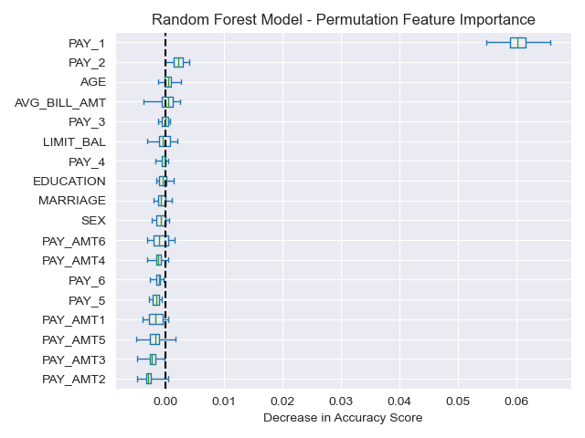
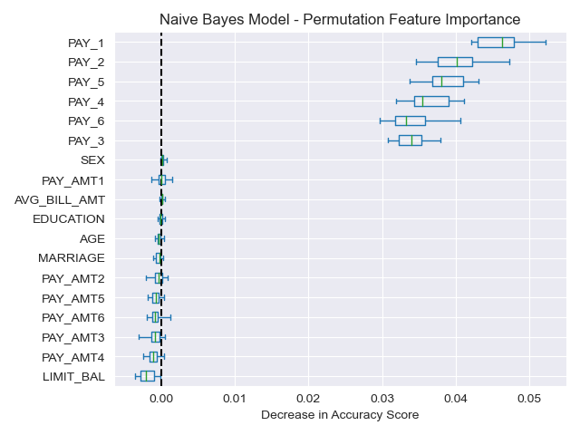

# Probability of Credit Card Default

# Overview
#### This project will develop models that predict the probability of credit card default. We will use a dataset that consists of information for 30,000 customers, including whether they ended up defaulting the next month. We will perform exploratory data analysis to derive any important insights from the data that should improve the effectiveness of the models. After the models are developed, we’ll compare their performances and determine which has the most sufficient predictive power.

## Getting Started: 

#### Step 1. Import the required libraries and read in and clean the dataset:

###### Libraries imported; pandas, pathlib, numpy, matplotlib.pylot, seaborn, sklearn, statsmodel.stats.outliers_influence, statsmodel.api, and scipy. Then we read and cleaned the CSV file `default_credit_card_client` by checking for null values. Also adjusted some of the categories for a cleaner data set. 

###### MARRIAGE Variable:
* Original Categories: 1 = married; 2 = single; 3 = others
* Adjustment: Categorize all instances where 'MARRIAGE' is 0 as "others."

###### EDUCATION Variable:
* Original Categories: 1 = graduate school; 2 = university; 3 = high school; 4 = others
* Adjustment: Categorize all instances where 'EDUCATION' is 0, 5, or 6 as "others."

###### PAY_1 to PAY_6 Variables:
* Original Categories: -2, -1, 0, 1, 2, 3, 4, 5, 6, 7, 8, 9
* Adjustment: Categorize all instances where these variables are -2, -1, or 0 as "pay duly," and adjust "pay duly" from -1 to 0. 

#### Target and Feature Variables:

##### We use a binary variable, "DEFAULT" (Yes = 1, No = 0), as the target variable, indicating whether the individual defaulted the following month. The dataset includes 23 explanatory variables, such as 
* LIMIT_BAL, 
* SEX, EDUCATION, 
* MARRIAGE,
* AGE,
* PAY_1 to PAY_6,
* BILL_AMT1 to BILL_AMT6,
* PAY_AMT1 to PAY_AMT6.

### Step 2: Exploratory Data Analysis

#### In our project, we conducted Exploratory Data Analysis (EDA) to uncover patterns, trends, and correlations within the dataset. Initially, we separated the data into target and feature variables to explore the distribution of each variable. As part of our Exploratory Data Analysis, we delved into Multivariate Analysis, examining interactions among three or more variables. Notably, we identified a substantial correlation among the variables BILL_AMT1 - BILL_AMT6.

#### To gain deeper insights, we performed Bivariate Analysis, simultaneously scrutinizing pairs of variables to uncover patterns. The calculation of the Variance Inflation Factor (VIF) revealed high multicollinearity within AVG_BILL_AMT1 - AVG_BILL AMT6, as evidenced by VIF values exceeding 10. The overall correlation matrix further confirmed the strong correlation among these features.

#### Recognizing the presence of significant multicollinearity among the six 'BILL_AMT' features, our strategy involves preprocessing the DataFrame. Specifically, we calculated the average of these six columns and replaced them with a single 'AVG_BILL_AMT' column. This consolidation aims to mitigate multicollinearity concerns. Following this preprocessing step, we split the data into training and testing sets and subsequently standardize them for further analysis.

### Step 3: Develop machine learning models to fit the data:

#### Trained and tested three models Logistic regression, Random Forest, and Naive Bayes. 
 
#### 1. Logistic Regression Result:

##### Logistic Regression Model Balanced Accuracy Score: 0.63
##### Classification Report

##### Confusion Matrix

##### Logistic Regression Analysis: 

##### Class 0 (Non-default) Predictions:
* Precision: 96% (High accuracy in predicting non-default cases).
* Recall: 83% (Effective identification of actual non-default instances).
* F1-Score: 89% (Overall performance for non-default class).

##### Class 1 (Default) Predictions:
* Precision: 31% (Lower precision in predicting default cases).
* Recall: 68% (Moderate ability to capture actual default instances).
* F1-Score: 43% (Trade-off between precision and recall for default class).

##### Overall Performance:
* Accuracy: 81% (Overall correctness of predictions).
* Macro Average F1-Score : 66% (Unweighted average of class-specific F1-Scores).
* Weighted Average F1-Score : 84% (Weighted average considering class imbalance).

#### 2. Random Forest Results:

##### Random Forest Model Balanced Accuracy Score: 0.65
##### Classification Report

##### Confusion Matrix

##### Random Forest Analysis:

##### Class 0 (Non-default) Predictions:
* Precision: 84% (High precision in predicting non-default cases).
* Recall: 94% (High ability to identify actual non-default instances).
* F1-Score: 89% (Overall strong performance for non-default class).

##### Class 1 (Default) Predictions:
* Precision: Precision: 64% (Moderate precision in predicting default cases).
* Recall: 36% (Limited ability to capture actual default instances).
* F1-Score: 46% (Moderate overall performance for default class).

##### Overall Performance:
* Accuracy: 81% (Overall correctness of predictions).
* Macro Average F1-Score: 67% (Unweighted average of class-specific F1-Scores).
* Weighted Average F1-Score: 79% (Weighted average considering class imbalance

#### 3. Naive Bayes Results: 

##### Naive Bayes Model Balanced Accuracy Score: 0.69
##### Classification Report 

##### Confusion Matrix

##### Naive Bayes Analysis:

##### Class 0 (Non-default) Predictions:
* Precision: 86% (High precision in predicting non-default cases).
* Recall: 83% (Good ability to identify actual non-default instances).
* F1-Score: 85% (Overall strong performance for non-default class).

##### Class 1 (Default) Predictions:
* Precision: 48% (Moderate precision in predicting default cases).
* Recall: 55% (Moderate ability to capture actual default instances).
* F1-Score: 51% (Moderate overall performance for default class).

##### Overall Performance:
* Accuracy: 77% (Overall correctness of predictions).
* Macro Average F1-Score: 68% (Unweighted average of class-specific F1-Scores).
* Weighted Average F1-Score: 77% (Weighted average considering class imbalance).

### Step 4: Feature Importance Analysis: 
#### Permutation importance reflects how important a feature is for a particular model, it is also model-agnostic; meaning it can be applied to any fitted estimator. In our Project we calculated the permutation feature importance for each model to see which features were the most important to that particular model. 

##### 1. Logistic Regression
 
     
 

##### The most important feature is PAY_1 the least important feature is MARRIAGE.

##### 2. Random Forest
 
     
 

##### The most important feature is PAY_1 the least important feature is PAY_AMT2.

* 3. Naive Bayes
 
     

##### The most important feature is PAY_1 the least important feature is LIMIT_BAL.

### Summary Analysis: 

#### In the project, logistic regression and random forest models both achieved an accuracy score of 0.81, while the Naïve Bayes model scored slightly lower at 0.77. The balanced accuracy scores, considering class imbalances, were also comparable across models.

#### Given the project's goal of minimizing False Negatives, where false negatives are considered the most undesirable outcome, prioritizing high recall becomes crucial. Upon examining the classification reports for each model, it is observed that the logistic regression model exhibits the highest recall among the three models.

#### Therefore, based on the emphasis on minimizing false negatives and prioritizing recall, the Naive Bayes model appears to be the most suitable model for predicting clients who will not default.

## Resources:

### Data Source:
* Yeh,I-Cheng. (2016). default of credit card clients. UCI Machine Learning Repository. https://doi.org/10.24432/C55S3H.
  
* https://scikit-learn.org/stable/modules/permutation_importance.html#:~:text=The%20permutation%20feature%20importance%20is,model%20depends%20on%20the%20feature.

    
