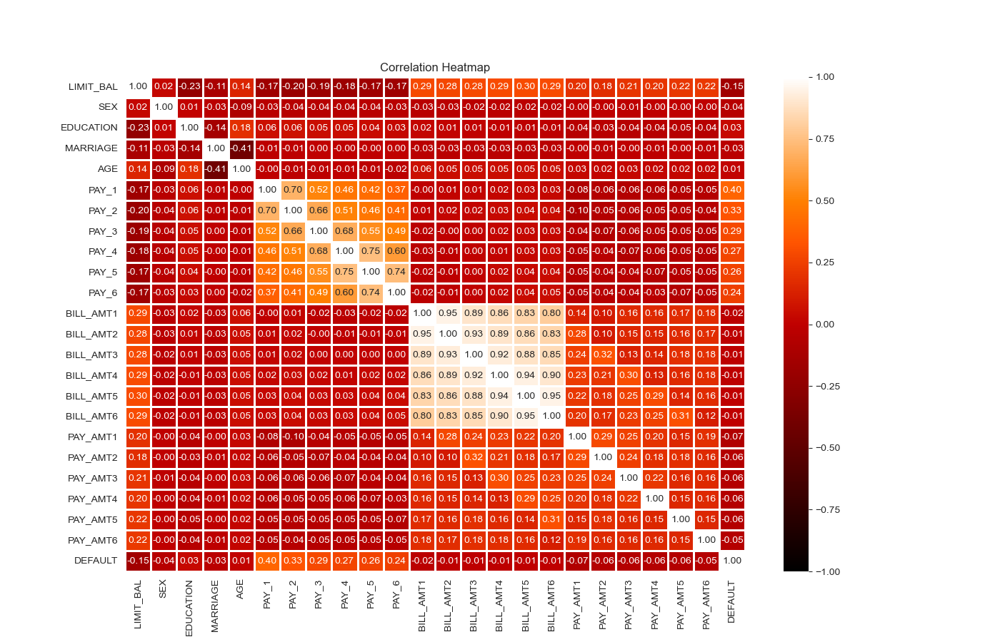

# Probability of Credit Card Default

# Overview
#### This project will develop models that predict the probability of credit card default. We will use a dataset that consists of information for 30,000 customers, including whether they ended up defaulting the next month. We will perform exploratory data analysis to derive any important insights from the data that should improve the effectiveness of the models. After the models are developed, we’ll compare their performances and determine which has the most sufficient predictive power.

## Getting Started: 

### Step 1. Import the required libraries and read in and clean the dataset:

###### Libraries imported: pandas, pathlib, numpy, matplotlib.pylot, seaborn, sklearn, statsmodel.stats.outliers_influence, statsmodel.api, and scipy. Then we read in the CSV file `default_credit_card_client` and cleaned it a few different ways. First, we set the index as the “ID” column. Next, we didn’t think we needed the first row of the original dataset with the X variables so we decided to skip that row when reading in the data. We also decided to rename a couple of the columns to clean it up a little bit; we changed “PAY_0” to “PAY_1” to make it more orderly, and then we shortened “default payment next month’ to “DEFAULT”. Lastly, we checked for null values within the data but there were none.

#### Target and Feature Variables:

##### The dataset used a binary variable, "DEFAULT" (Yes = 1, No = 0), as the target variable, indicating whether the individual defaulted the following month. The dataset we chose to use tracked the past monthly payment records (from April to September 2005) of 30,000 individuals and used 23 variables as independent variables. The documentation we were given with the dataset gave descriptions for each variable, which was important since the categorical variables had already been encoded.

* LIMIT_BAL: Dollar amount of the given credit (New Taiwan Dollar)
* SEX: (1 = male; 2 = female)
* EDUCATION: (1 = graduate school; 2 = university; 3 = high school; 4 = others)
* MARRIAGE: Marital status (1 = married; 2 = single; 3 = others)
* AGE: (year)
* PAY_1 to PAY_6: History of past payment (-1 = pay duly; 1 = payment delay for one month; 2 = payment delay for two months; . . .; 9 = payment delay for nine months and above)
* BILL_AMT1 to BILL_AMT6: Dollar amount of bill statement (New Taiwan Dollar)
* PAY_AMT1 to PAY_AMT6: Dollar amount of previous payment (New Taiwan Dollar)

### Step 2: Exploratory Data Analysis

##### In our project, we conducted Exploratory Data Analysis (EDA) to uncover patterns, trends, and correlations within the dataset. Initially, we separated the data into target and feature variables. Then we created distribution plots for each of the variables. Doing this allowed us to visualize each variable a little better, and ended up giving rise to a couple oddities within some of the independent variables. We determined it would be best to safely reclassify the following:

###### MARRIAGE Variable:
* Classes: 1 = married; 2 = single; 3 = others
* Adjustment: Reclassify all instances where 'MARRIAGE' is 0 as "others"

###### EDUCATION Variable:
* Classes: 1 = graduate school; 2 = university; 3 = high school; 4 = others
* Adjustment: Reclassify all instances where 'EDUCATION' is 0, 5, or 6 as "others"

###### PAY_1 to PAY_6 Variables:
* Original Classes: -1, 1, 2, 3, 4, 5, 6, 7, 8, 9
* Adjustment: Reclassify all instances where these variables are -2, -1, or 0 as "pay duly," and adjust "pay duly" from -1 to 0. 

##### The next step we took as part of our Exploratory Data Analysis, we delved into Multivariate Analysis, examining interactions among three or more variables. Notably, we identified a substantial correlation among the variables BILL_AMT1 - BILL_AMT6 based on the correlation matrix. The main area that stood out to us was the tan area with correlations of 0.80 and higher. This immediately signaled to us that there was a strong positive correlation between the 6 ‘BILL_AMT’ variables.

### Step 3: Pre-Processing

##### In this pre-processing section, we prepared the data for our models. This included choosing the columns to be our independent variables. Since we determined that there was some strong correlation between the 6 ‘BILL_AMT’ variables in the data, we decided it would be best to dive deeper into this multicollinearity before starting to model. We discovered that multicollinearity can create a problem in the model because the inputs are influencing each other and aren’t truly independent. We used the variance inflation factor (VIF) to provide us with a measure of multicollinearity for the independent variables. Any value above 10 indicates very strong multicollinearity, so the VIF values confirmed that the ‘BILL_AMT’ variables were collinear and redundant. Consequently, we decided to calculate the average of these ‘BILL_AMT’ columns and replace the six columns with a single 'AVG_BILL_AMT' column. Once we did this, we calculated the VIF again and could see the multicollinearity decreased significantly. We used this updated DataFrame for our modeling, split the data into training and testing sets, and subsequently standardized the feature variables.

### Step 4: Develop machine learning models to fit the data:

#### Trained and tested three models Logistic regression, Random Forest, and Naive Bayes. 
 
#### 1. Logistic Regression Result:

##### Logistic Regression Model Balanced Accuracy Score: 0.63
##### Classification Report

##### Confusion Matrix

##### Logistic Regression Analysis: 

##### Class 0 (Non-default) Predictions:
* Precision: 96% (High accuracy in predicting non-default cases).
* Recall: 83% (Effective identification of actual non-default instances).
* F1-Score: 89% (Overall performance for non-default class).

##### Class 1 (Default) Predictions:
* Precision: 31% (Lower precision in predicting default cases).
* Recall: 68% (Moderate ability to capture actual default instances).
* F1-Score: 43% (Trade-off between precision and recall for default class).

##### Overall Performance:
* Accuracy: 81% (Overall correctness of predictions).
* Macro Average F1-Score : 66% (Unweighted average of class-specific F1-Scores).
* Weighted Average F1-Score : 84% (Weighted average considering class imbalance).

#### 2. Random Forest Results:

##### Random Forest Model Balanced Accuracy Score: 0.65
##### Classification Report

##### Confusion Matrix

##### Random Forest Analysis:

##### Class 0 (Non-default) Predictions:
* Precision: 84% (High precision in predicting non-default cases).
* Recall: 94% (High ability to identify actual non-default instances).
* F1-Score: 89% (Overall strong performance for non-default class).

##### Class 1 (Default) Predictions:
* Precision: Precision: 64% (Moderate precision in predicting default cases).
* Recall: 36% (Limited ability to capture actual default instances).
* F1-Score: 46% (Moderate overall performance for default class).

##### Overall Performance:
* Accuracy: 81% (Overall correctness of predictions).
* Macro Average F1-Score: 67% (Unweighted average of class-specific F1-Scores).
* Weighted Average F1-Score: 79% (Weighted average considering class imbalance

#### 3. Naive Bayes Results: 

##### Naive Bayes Model Balanced Accuracy Score: 0.69
##### Classification Report 

##### Confusion Matrix

##### Naive Bayes Analysis:

##### Class 0 (Non-default) Predictions:
* Precision: 86% (High precision in predicting non-default cases).
* Recall: 83% (Good ability to identify actual non-default instances).
* F1-Score: 85% (Overall strong performance for non-default class).

##### Class 1 (Default) Predictions:
* Precision: 48% (Moderate precision in predicting default cases).
* Recall: 55% (Moderate ability to capture actual default instances).
* F1-Score: 51% (Moderate overall performance for default class).

##### Overall Performance:
* Accuracy: 77% (Overall correctness of predictions).
* Macro Average F1-Score: 68% (Unweighted average of class-specific F1-Scores).
* Weighted Average F1-Score: 77% (Weighted average considering class imbalance).

### Step 5: Feature Importance Analysis: 
#### Permutation feature importance reflects how important a feature is for a particular model by shuffling its values and determining how this impacts the accuracy score. This way of calculating feature importance is also model-agnostic; meaning it can be applied to any fitted estimator. The following visualizations show the permutation feature importance for each model:

#### 1. Logistic Regression
 
     
 

##### The most important feature is PAY_1 the least important feature is MARRIAGE.

#### 2. Random Forest
 
     
 

##### The most important feature is PAY_1 the least important feature is PAY_AMT2.

#### 3. Naive Bayes
 
     

##### The most important feature is PAY_1 the least important feature is LIMIT_BAL.

### Step 6: Summary Analysis: 

#### In the project, logistic regression and random forest models both achieved an accuracy score of 0.81, while the Naïve Bayes model scored slightly lower at 0.77. The balanced accuracy scores, considering class imbalances, were also comparable across models. These are both useful metrics when looking at the overall predictive power of the models. However, we decided that in this situation the false negatives are the most undesirable outcome. We would be willing to accept more false positives, in return for reducing the number of false negatives. Therefore, a model with high recall is the most important to us.

##### Logistic Regression:

True Positives: 521

False Negatives: 1147

Recall = 521 / (521+1147) = 0.31 

##### Random Forest:

True Positives: 595
 
False Negatives: 1073

Recall = 595 / (595+1073) = 0.36 

##### Naïve Bayes:

True Positives: 911

False Negatives: 757

Recall = 911 / (911+757) = 0.55

#### Therefore, based on the emphasis on minimizing false negatives and prioritizing recall, the Naive Bayes model appears to be the most suitable model for predicting client default with a recall of 0.55.

## Resources:

* Yeh,I-Cheng. (2016). default of credit card clients. UCI Machine Learning Repository. https://doi.org/10.24432/C55S3H.
* https://scikit-learn.org/stable/modules/permutation_importance.html#:~:text=The%20permutation%20feature%20importance%20is,model%20depends%20on%20the%20feature.

    
